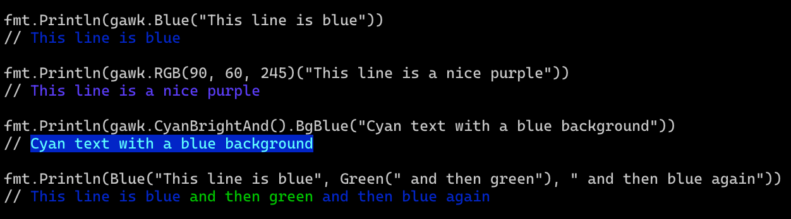

# Gawk

Gawk is a library heavily inspired by/based on [chalk](https://github.com/chalk/chalk), the popular Node.js terminal color library, and using golang ports of [supports-color](https://github.com/jwalton/go-supportscolor) and [ansi-styles](https://github.com/jwalton/gawk/pkg/ansistyles).



## Features

- Expressive API
- Highly performant
- Ability to nest styles
- [256/Truecolor color support](https://github.com/jwalton/gawk#256-and-truecolor-color-support)
- Auto-detects color support
- Painless [Windows 10 support](https://github.com/jwalton/gawk#windows-10-support)
- Actively maintained

## Install

```sh
go get github.com/jwalton/gawk
```

## Usage

```go
package main

import (
    "fmt"
    "github.com/jwalton/gawk"
)

func main() {
    fmt.Println(gawk.Blue("This line is blue"))
}
```

Note that this works on all platforms - there"s no need to write to a special stream or use a special print function to get color on Windows 10.

Gawk uses a chainable syntax for composing styles together, which should be instantly familiar if you've ever used chalk or similar libraries. To style a string blue, for example, you"d call `gawk.Blue("hello")`. To style it blue with a red background, you can use `gawk.WithBgRed().Blue("hello")`.

```go
// Combine styled and normal strings
fmt.Println(gawk.Blue("Hello") + " World" + gawk.Red("!"))

// Compose multiple styles using the chainable API
fmt.Println(gawk.WithBlue().WithBgRed().Bold("Hello world!"))

// Pass in multiple arguments
fmt.Println(gawk.Blue("Hello", "World!", "Foo", "bar", "biz", "baz"))

// Nest styles
fmt.Println(gawk.Green(
    "I am a green line " +
    gawk.WithBlue().WithUnderline().Bold("with a blue substring") +
    " that becomes green again!"
))

// Use RGB colors in terminal emulators that support it.
fmt.Println(gawk.WithRGB(123, 45, 67).Underline("Underlined reddish color"))
fmt.Println(gawk.WihHex("#DEADED").Bold("Bold gray!"))

// Use color name strings
fmt.Println(gawk.StyleMust("blue")("Hello World!"))


// Write to stderr:
os.Stderr.WriteString(gawk.Stderr.Red("Ohs noes!\n"))
```

You can easily define your own themes:

```go
var error = gawk.WithBold().Red
var warning = gawk.Yellow

fmt.Println(error("Error!"))
fmt.Println(warning("Warning!"))
```

## API

### gawk[.With&lt;style>][.with&lt;style>...].&lt;style>(string [, string...])

Example: `gawk.WithRed().WithBold.Underline("Hello", "world")`

Chain styles and call the last one as a method with a string argument. Order doesn't matter, and later styles take precedent in case of a conflict. Multiple arguments will be separated by a space.

### gawk.Style(style [, style...])(string [, string...])

Example:

```go
styler, err := gawk.Style("bold", "red")
if err == nil {
    fmt.Println(styler("This is bold and red"))
}

fmt.Println(gawk.StyleMust("bold", "red")("This is also bold and red."))
```

`Style` and `StyleMust` allow styling a string based on the names of colors and modifiers. There's also a `WithStyle` and `WithStyleMust` for chaining named styles with other styles.

### gawk.SetLevel(level) and gawk.GetLevel()

Specifies the level of color support. Color support is automatically detected using [supportscolor](https://github.com/jwalton/go-supportscolor), and [flags and command line arguments](https://github.com/jwalton/go-supportscolor#info) supported by supportscolor are also supported here.

You can override the detected level by calling `SetLevel()`. You should however only do this in your own application, as it applies globally to all gawk consumers. If you need to change this in a library, create a new instance:

```go
var myGawk = gawk.New(gawk.ForceLevel(gawk.LevelNone))
```

|       Level        | Description                           |
| :----------------: | :------------------------------------ |
|  `LevelNone = 0`   | All colors disabled                   |
|  `LevelBasic = 1`  | Basic color support (16 colors)       |
| `LevelAnsi256 = 2` | 256 color support                     |
| `LevelAnsi16m = 3` | Truecolor support (16 million colors) |

### gawk.Stderr

`gawk.Stderr` contains a separate instance configured with color support detected for `stderr` stream instead of `stdout`.

### gawk.New(options...)

Creates a new instance of gawk. Options include:

- `gawk.ForceLevel(level)` - Force the color level. If not specified, will be autodetected from stdout.

## Styles

### Modifiers

- `Reset` - Resets the current color chain.
- `Bold` - Make text bold.
- `Dim` - Emitting only a small amount of light.
- `Italic` - Make text italic. _(Not widely supported)_
- `Underline` - Make text underline. _(Not widely supported)_
- `Inverse`- Inverse background and foreground colors.
- `Hidden` - Prints the text, but makes it invisible.
- `Strikethrough` - Puts a horizontal line through the center of the text. _(Not widely supported)_
- `Visible`- Prints the text only when Chalk has a color level > 0. Can be useful for things that are purely cosmetic.

### Colors

- `Black`
- `Red`
- `Green`
- `Yellow`
- `Blue`
- `Magenta`
- `Cyan`
- `White`
- `BlackBright` (alias: `gray`, `grey`)
- `RedBright`
- `GreenBright`
- `YellowBright`
- `BlueBright`
- `MagentaBright`
- `CyanBright`
- `WhiteBright`

### Background colors

- `BgBlack`
- `BgRed`
- `BgGreen`
- `BgYellow`
- `BgBlue`
- `BgMagenta`
- `BgCyan`
- `BgWhite`
- `BgBlackBright` (alias: `BgGray`, `BgGrey`)
- `BgRedBright`
- `BgGreenBright`
- `BgYellowBright`
- `BgBlueBright`
- `BgMagentaBright`
- `BgCyanBright`
- `BgWhiteBright`

## 256 and Truecolor color support

Gawk supports 256 colors and [Truecolor](https://gist.github.com/XVilka/8346728) (16 million colors) on supported terminal apps, including Windows 10.

Colors are downsampled from 16 million RGB values to an ANSI color format that is supported by the terminal emulator (or by specifying `{level: n}` as a Chalk option). For example, Gawk configured to run at level 1 (basic color support) will downsample an RGB value of #FF0000 (red) to 91 (ANSI escape for bright-red).

Examples:

- `gawk.WithHex('#DEADED').Underline('Hello, world!')`
- `gawk.WithRGB(15, 100, 204).Inverse('Hello!')`

Background versions of these models are prefixed with `Bg` and the first level of the module capitalized:

- `gawk.WithBgHex('#DEADED').Underline('Hello, world!')`
- `gawk.WithBgRgb(15, 100, 204).Unverse('Hello!')`

The following color models can be used:

- [`rgb`](https://en.wikipedia.org/wiki/RGB_color_model) - Example: `gawk.RGB(255, 136, 0)('Orange!')`
- [`hex`](https://en.wikipedia.org/wiki/Web_colors#Hex_triplet) - Example: `gawk.Hex('#FF8800')('Orange!')`
- [`ansi256`](https://en.wikipedia.org/wiki/ANSI_escape_code#8-bit) - Example: `gawk.BgAnsi256(194)('Honeydew, more or less')`
- [`ansi`](https://en.wikipedia.org/wiki/ANSI_escape_code#3/4_bit) - Example: `gawk.WithAnsi(31).BgAnsi(93)('red on yellowBright')`

## Windows 10 Support

Gawk is cross-platform, and will work on Linux and MacOS systems, but will also work on Windows 10, and without the need for writing to a special stream or using [ansicon](https://github.com/adoxa/ansicon).

Many ANSI color libraries for Go do a poor job of handling colors in Windows. This is because historically, Windows has not supported ANSI color codes, so hacks like ansicon or [go-colorable](https://github.com/mattn/go-colorable) were required. However, Windows 10 has supported ANSI escape codes since 2017 (build 10586 for 256 color support, and build 14931 for 16.7 million true color support). In [Windows Terminal](https://github.com/Microsoft/Terminal) this is enabled by default, but in `CMD.EXE` or PowerShell, ANSI support must be enabled via [`ENABLE_VIRTUAL_TERMINAL_PROCESSING`](https://docs.microsoft.com/en-us/windows/console/console-virtual-terminal-sequences). Gawk, of course, takes care of all of this for you. This functionality is also availabile in the [supportscolor](https://github.com/jwalton/go-supportscolor) library if you're an ANSI library author and you'd like to add this functionality to your own project.

## Related

- [ansistyles](https://github.com/jwalton/gawk/pkg/ansistyles) - A low level library for generating ANSI escape codes, ported from Node.js's [ansi-styles](https://github.com/chalk/ansi-styles).
- [supportscolor](https://github.com/jwalton/go-supportscolor) - Detect whether a terminal supports color, ported from Node.js's [supports-color](https://github.com/chalk/supports-color).
